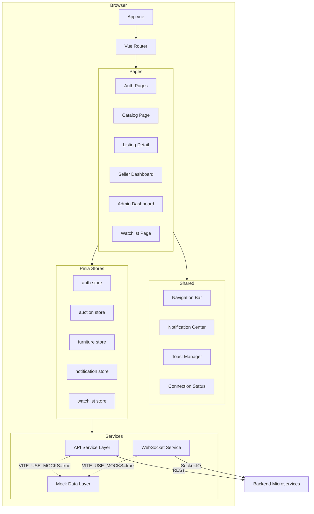
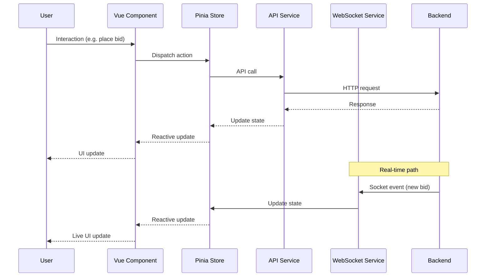
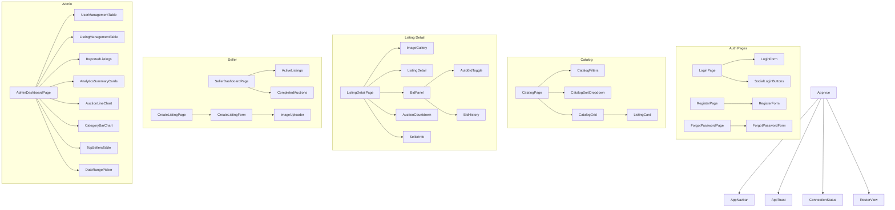
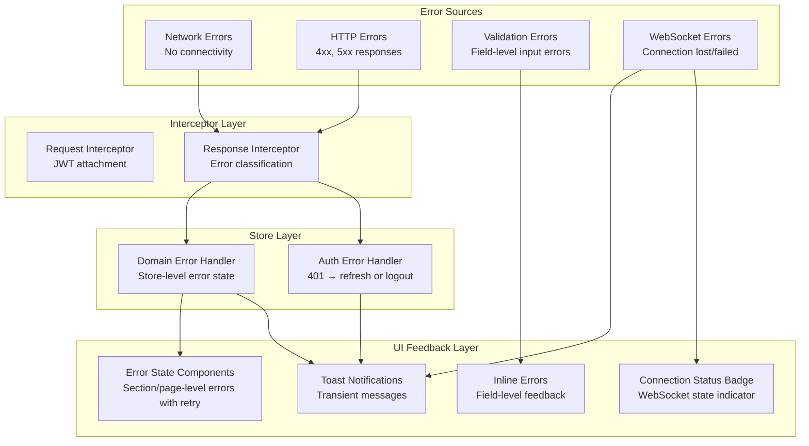

# Design Document: Furniture Bid System

## Overview

The Furniture Bid System is a Vue 3 + TypeScript single-page application that provides a real-time auction marketplace for furniture. The front-end communicates with six backend microservices (Identity, User Profile, Auction, Furniture, Notification, Payment) via REST APIs and maintains persistent WebSocket connections for live auction updates.

The architecture prioritizes:
- **Real-time responsiveness** — Socket.IO integration delivers sub-second bid updates and notifications
- **Independent development** — A mock mode allows full front-end development without backend services
- **Role-based access** — Route guards and UI conditionals adapt the experience for Buyer, Seller, and Admin roles
- **Offline resilience** — Graceful degradation when WebSocket or API connectivity is lost

### Key Design Decisions

| Decision | Rationale |
|----------|-----------|
| Pinia over Vuex | First-class TypeScript support, simpler API, official Vue recommendation |
| Socket.IO over raw WebSocket | Built-in reconnection, room-based channels, event typing |
| Axios with interceptors | Centralized auth injection, error handling, mock layer swap |
| TailwindCSS | Utility-first approach enables rapid responsive design without custom CSS overhead |
| VeeValidate + Zod | Schema-based validation with composable form fields |
| Chart.js via vue-chartjs | Lightweight charting with Vue reactivity bindings |

## Architecture

### High-Level Component Architecture



### Data Flow Architecture



## Components and Interfaces

### Project Structure

```
src/
├── App.vue
├── main.ts
├── router/
│   ├── index.ts              # Router instance and route definitions
│   └── guards.ts             # Navigation guards (auth, role-based)
├── stores/
│   ├── auth.ts               # Auth state (token, user, role)
│   ├── auction.ts            # Auction/bidding state
│   ├── furniture.ts          # Listings cache and filters
│   ├── notification.ts       # Notifications and unread count
│   └── watchlist.ts          # Watched item IDs and status
├── services/
│   ├── api/
│   │   ├── client.ts         # Axios instance with interceptors
│   │   ├── authService.ts    # Identity Service endpoints
│   │   ├── userProfileService.ts
│   │   ├── auctionService.ts
│   │   ├── furnitureService.ts
│   │   ├── notificationService.ts
│   │   └── paymentService.ts
│   ├── websocket/
│   │   ├── socketClient.ts   # Socket.IO singleton
│   │   └── events.ts         # Event type definitions
│   └── mock/
│       ├── index.ts          # Mock mode toggle
│       ├── mockData.ts       # Realistic sample data generators
│       ├── mockApiHandlers.ts
│       └── mockSocketHandlers.ts
├── composables/
│   ├── useAuth.ts            # Auth logic composable
│   ├── useAuction.ts         # Bid placement and auto-bid
│   ├── useCountdown.ts       # Auction countdown timer
│   ├── useInfiniteScroll.ts  # Infinite scroll/pagination
│   ├── useImageGallery.ts    # Image gallery navigation
│   ├── useNotification.ts    # Notification management
│   └── useWebSocket.ts       # WebSocket subscription helpers
├── components/
│   ├── common/
│   │   ├── AppNavbar.vue
│   │   ├── AppToast.vue
│   │   ├── AppModal.vue
│   │   ├── ConnectionStatus.vue
│   │   ├── PaginationControls.vue
│   │   ├── EmptyState.vue
│   │   ├── ErrorState.vue
│   │   └── LoadingSpinner.vue
│   ├── auth/
│   │   ├── LoginForm.vue
│   │   ├── RegisterForm.vue
│   │   ├── ForgotPasswordForm.vue
│   │   └── SocialLoginButtons.vue
│   ├── catalog/
│   │   ├── CatalogGrid.vue
│   │   ├── CatalogFilters.vue
│   │   ├── CatalogSortDropdown.vue
│   │   └── ListingCard.vue
│   ├── listing/
│   │   ├── ListingDetail.vue
│   │   ├── ImageGallery.vue
│   │   ├── BidPanel.vue
│   │   ├── BidHistory.vue
│   │   ├── AutoBidToggle.vue
│   │   ├── AuctionCountdown.vue
│   │   └── SellerInfo.vue
│   ├── watchlist/
│   │   ├── WatchlistGrid.vue
│   │   └── WatchlistCard.vue
│   ├── notifications/
│   │   ├── NotificationBell.vue
│   │   ├── NotificationDropdown.vue
│   │   └── NotificationItem.vue
│   ├── seller/
│   │   ├── CreateListingForm.vue
│   │   ├── ImageUploader.vue
│   │   ├── ActiveListings.vue
│   │   ├── CompletedAuctions.vue
│   │   └── SellerListingCard.vue
│   └── admin/
│       ├── UserManagementTable.vue
│       ├── ListingManagementTable.vue
│       ├── ReportedListings.vue
│       ├── AnalyticsSummaryCards.vue
│       ├── AuctionLineChart.vue
│       ├── CategoryBarChart.vue
│       ├── TopSellersTable.vue
│       └── DateRangePicker.vue
├── pages/
│   ├── LoginPage.vue
│   ├── RegisterPage.vue
│   ├── ForgotPasswordPage.vue
│   ├── CatalogPage.vue
│   ├── ListingDetailPage.vue
│   ├── WatchlistPage.vue
│   ├── BiddingHistoryPage.vue
│   ├── SellerDashboardPage.vue
│   ├── CreateListingPage.vue
│   ├── AdminDashboardPage.vue
│   ├── UserProfilePage.vue
│   └── NotFoundPage.vue
├── types/
│   ├── auth.ts
│   ├── furniture.ts
│   ├── auction.ts
│   ├── notification.ts
│   ├── user.ts
│   └── common.ts
├── utils/
│   ├── formatters.ts         # Currency, date, time formatters
│   ├── validators.ts         # Validation schemas (Zod)
│   └── constants.ts          # App-wide constants
└── assets/
    └── styles/
        └── tailwind.css      # Tailwind directives and custom utilities
```

### Component Hierarchy by Page



## Data Models

### TypeScript Interfaces

```typescript
// types/auth.ts
export type UserRole = 'buyer' | 'seller' | 'admin';

export interface User {
  id: string;
  email: string;
  displayName: string;
  role: UserRole;
  avatarUrl?: string;
  createdAt: string;
}

export interface AuthTokenPayload {
  userId: string;
  role: UserRole;
  exp: number;
}

export interface LoginRequest {
  email: string;
  password: string;
}

export interface RegisterRequest {
  email: string;
  password: string;
  displayName: string;
}

export interface LoginResponse {
  token: string;
  user: User;
}

export interface PasswordResetRequest {
  email: string;
}
```

```typescript
// types/furniture.ts
export type FurnitureCategory =
  | 'sofa'
  | 'dining-table'
  | 'office-chair'
  | 'wardrobe'
  | 'bed-frame'
  | 'coffee-table'
  | 'cabinet'
  | 'bookshelf';

export type FurnitureCondition = 'new' | 'like-new' | 'good' | 'fair' | 'poor';

export type ListingStatus = 'active' | 'ended' | 'flagged' | 'removed';

export interface Dimensions {
  width: number;   // centimeters
  height: number;  // centimeters
  length: number;  // centimeters
}

export interface FurnitureListing {
  id: string;
  title: string;
  description: string;
  category: FurnitureCategory;
  condition: FurnitureCondition;
  brand?: string;
  material?: string;
  dimensions: Dimensions;
  weight?: number;           // kilograms
  location?: string;
  images: string[];          // URL array, 1–10 images
  startingPrice: number;
  reservePrice: number;
  currentBid: number;
  bidCount: number;
  auctionEndDate: string;    // ISO 8601
  status: ListingStatus;
  sellerId: string;
  sellerDisplayName: string;
  sellerRating: number;
  createdAt: string;
}

export interface FurnitureListingSummary {
  id: string;
  title: string;
  thumbnailUrl: string;
  currentBid: number;
  timeRemaining: number;     // milliseconds
  condition: FurnitureCondition;
  category: FurnitureCategory;
}

export interface CreateListingRequest {
  title: string;
  description: string;
  category: FurnitureCategory;
  condition: FurnitureCondition;
  brand?: string;
  material?: string;
  dimensions: Dimensions;
  weight?: number;
  location?: string;
  startingPrice: number;
  reservePrice: number;
  auctionEndDate: string;
  images: File[];
}

export interface CatalogFilters {
  category?: FurnitureCategory[];
  condition?: FurnitureCondition[];
  priceMin?: number;
  priceMax?: number;
  location?: string;
}

export type CatalogSortOption =
  | 'ending-soonest'
  | 'price-low-high'
  | 'price-high-low'
  | 'newest';

export interface CatalogQuery {
  filters: CatalogFilters;
  sort: CatalogSortOption;
  page: number;
  pageSize: number;          // default 20
}
```

```typescript
// types/auction.ts
export type AuctionResult = 'won' | 'lost' | 'reserve-not-met' | 'active';

export interface Bid {
  id: string;
  auctionId: string;
  bidderId: string;
  bidderAlias: string;       // anonymized identifier
  amount: number;
  timestamp: string;         // ISO 8601
}

export interface PlaceBidRequest {
  auctionId: string;
  amount: number;
}

export interface PlaceBidResponse {
  success: boolean;
  bid?: Bid;
  error?: string;
}

export interface AutoBidConfig {
  auctionId: string;
  maxAmount: number;
  isActive: boolean;
}

export interface AutoBidRequest {
  auctionId: string;
  maxAmount: number;
}

export interface BidHistoryQuery {
  auctionId: string;
  page: number;
  pageSize: number;          // default 20
}

export interface SellerActiveListing {
  id: string;
  title: string;
  currentBid: number;
  bidCount: number;
  timeRemaining: number;     // milliseconds
}

export interface SellerCompletedAuction {
  id: string;
  title: string;
  winningBid: number;
  winnerDisplayName: string;
  reserveMet: boolean;
  endedAt: string;
}
```

```typescript
// types/notification.ts
export type NotificationType =
  | 'outbid'
  | 'auction-ending'
  | 'auction-won'
  | 'auction-lost'
  | 'auto-bid-placed'
  | 'auto-bid-limit-reached';

export interface Notification {
  id: string;
  type: NotificationType;
  title: string;
  message: string;
  auctionId: string;
  isRead: boolean;
  createdAt: string;
}

export interface NotificationListQuery {
  page: number;
  pageSize: number;          // default 20
}
```

```typescript
// types/user.ts
export type AccountStatus = 'active' | 'suspended' | 'deleted';

export interface AdminUserRow {
  id: string;
  displayName: string;
  email: string;
  role: UserRole;
  registeredAt: string;
  status: AccountStatus;
}

export interface AdminListingRow {
  id: string;
  title: string;
  sellerDisplayName: string;
  status: ListingStatus;
  currentBid: number;
  reportCount: number;
}

export interface ListingReport {
  id: string;
  listingId: string;
  reason: string;
  reporterDisplayName: string;
  reportDate: string;
}

export interface AnalyticsSummary {
  totalUsers: number;
  activeAuctions: number;
  completedAuctions: number;
  totalRevenue: number;
}

export interface AuctionTrend {
  date: string;
  auctionsCreated: number;
  auctionsCompleted: number;
}

export interface CategoryDistribution {
  category: FurnitureCategory;
  count: number;
}

export interface TopSeller {
  displayName: string;
  completedAuctions: number;
  totalRevenue: number;
}

export interface AnalyticsQuery {
  startDate: string;
  endDate: string;
}
```

```typescript
// types/common.ts
export interface PaginatedResponse<T> {
  data: T[];
  total: number;
  page: number;
  pageSize: number;
  hasMore: boolean;
}

export interface ApiError {
  statusCode: number;
  errorCode: string;
  message: string;
  fieldErrors?: Record<string, string>;
}

export type ConnectionStatus = 'connected' | 'reconnecting' | 'disconnected';

export interface WebSocketEvent<T = unknown> {
  event: string;
  payload: T;
  timestamp: string;
}

export interface BidUpdateEvent {
  auctionId: string;
  currentBid: number;
  bidCount: number;
  bidderAlias: string;
  timestamp: string;
}

export interface AuctionEndEvent {
  auctionId: string;
  result: AuctionResult;
  winningBid?: number;
  winnerId?: string;
}
```

### Pinia Store Designs

```typescript
// stores/auth.ts
export const useAuthStore = defineStore('auth', () => {
  // State
  const token = ref<string | null>(null);
  const user = ref<User | null>(null);
  const isLoading = ref(false);

  // Getters
  const isAuthenticated = computed(() => !!token.value);
  const userRole = computed(() => user.value?.role ?? null);
  const userId = computed(() => user.value?.id ?? null);

  // Actions
  async function login(credentials: LoginRequest): Promise<void>;
  async function loginWithOAuth(provider: 'google' | 'facebook'): Promise<void>;
  async function register(data: RegisterRequest): Promise<void>;
  async function logout(): Promise<void>;
  async function refreshToken(): Promise<void>;
  async function restoreSession(): Promise<void>;
  function clearAuth(): void;

  // Persistence: token synced to localStorage
});
```

```typescript
// stores/auction.ts
export const useAuctionStore = defineStore('auction', () => {
  // State
  const currentBids = ref<Map<string, Bid[]>>(new Map());  // auctionId -> bids
  const autoBidConfigs = ref<Map<string, AutoBidConfig>>(new Map());
  const bidSubmitting = ref(false);

  // Getters
  const getBidsForAuction = (auctionId: string) => computed(() => currentBids.value.get(auctionId) ?? []);
  const getAutoBidConfig = (auctionId: string) => computed(() => autoBidConfigs.value.get(auctionId));
  const hasActiveBids = (auctionId: string) => computed(() => (currentBids.value.get(auctionId)?.length ?? 0) > 0);

  // Actions
  async function placeBid(request: PlaceBidRequest): Promise<PlaceBidResponse>;
  async function fetchBidHistory(query: BidHistoryQuery): Promise<void>;
  async function activateAutoBid(request: AutoBidRequest): Promise<void>;
  async function deactivateAutoBid(auctionId: string): Promise<void>;
  function handleBidUpdate(event: BidUpdateEvent): void;
});
```

```typescript
// stores/furniture.ts
export const useFurnitureStore = defineStore('furniture', () => {
  // State
  const listings = ref<FurnitureListingSummary[]>([]);
  const currentListing = ref<FurnitureListing | null>(null);
  const filters = ref<CatalogFilters>({});
  const sort = ref<CatalogSortOption>('ending-soonest');
  const page = ref(1);
  const hasMore = ref(true);
  const isLoading = ref(false);

  // Getters
  const activeFiltersCount = computed(() => /* count non-empty filters */);

  // Actions
  async function fetchListings(reset?: boolean): Promise<void>;
  async function fetchListingById(id: string): Promise<void>;
  async function createListing(data: CreateListingRequest): Promise<string>;
  function updateFilters(newFilters: CatalogFilters): void;
  function updateSort(newSort: CatalogSortOption): void;
  function updateCurrentBid(auctionId: string, bid: number, count: number): void;
});
```

```typescript
// stores/notification.ts
export const useNotificationStore = defineStore('notification', () => {
  // State
  const notifications = ref<Notification[]>([]);
  const unreadCount = ref(0);
  const isLoading = ref(false);

  // Getters
  const displayCount = computed(() => unreadCount.value > 99 ? '99+' : String(unreadCount.value));
  const recentNotifications = computed(() => notifications.value.slice(0, 20));

  // Actions
  async function fetchNotifications(query: NotificationListQuery): Promise<void>;
  function addNotification(notification: Notification): void;
  async function markAsRead(notificationId: string): Promise<void>;
  async function markAllAsRead(): Promise<void>;
});
```

```typescript
// stores/watchlist.ts
export const useWatchlistStore = defineStore('watchlist', () => {
  // State
  const watchedItems = ref<FurnitureListingSummary[]>([]);
  const watchedIds = ref<Set<string>>(new Set());
  const isLoading = ref(false);

  // Getters
  const watchlistCount = computed(() => watchedIds.value.size);
  const isWatched = (listingId: string) => computed(() => watchedIds.value.has(listingId));

  // Actions
  async function fetchWatchlist(): Promise<void>;
  async function addToWatchlist(listingId: string): Promise<void>;
  async function removeFromWatchlist(listingId: string): Promise<void>;
  function updateWatchedItemBid(auctionId: string, bid: number): void;
});
```

### Vue Router Configuration

```typescript
// router/index.ts
import { createRouter, createWebHistory } from 'vue-router';
import { authGuard, roleGuard } from './guards';

const routes: RouteRecordRaw[] = [
  // Public routes
  { path: '/login', name: 'login', component: () => import('@/pages/LoginPage.vue'), meta: { public: true } },
  { path: '/register', name: 'register', component: () => import('@/pages/RegisterPage.vue'), meta: { public: true } },
  { path: '/forgot-password', name: 'forgot-password', component: () => import('@/pages/ForgotPasswordPage.vue'), meta: { public: true } },
  { path: '/catalog', name: 'catalog', component: () => import('@/pages/CatalogPage.vue'), meta: { public: true } },
  { path: '/listing/:id', name: 'listing-detail', component: () => import('@/pages/ListingDetailPage.vue'), meta: { public: true } },

  // Buyer routes (authenticated)
  { path: '/watchlist', name: 'watchlist', component: () => import('@/pages/WatchlistPage.vue'), meta: { roles: ['buyer', 'seller', 'admin'] } },
  { path: '/bidding-history', name: 'bidding-history', component: () => import('@/pages/BiddingHistoryPage.vue'), meta: { roles: ['buyer', 'seller', 'admin'] } },
  { path: '/profile', name: 'profile', component: () => import('@/pages/UserProfilePage.vue'), meta: { roles: ['buyer', 'seller', 'admin'] } },

  // Seller routes
  { path: '/seller/dashboard', name: 'seller-dashboard', component: () => import('@/pages/SellerDashboardPage.vue'), meta: { roles: ['seller', 'admin'] } },
  { path: '/seller/create-listing', name: 'create-listing', component: () => import('@/pages/CreateListingPage.vue'), meta: { roles: ['seller', 'admin'] } },

  // Admin routes
  { path: '/admin', name: 'admin-dashboard', component: () => import('@/pages/AdminDashboardPage.vue'), meta: { roles: ['admin'] } },

  // Catch-all redirect
  { path: '/:pathMatch(.*)*', redirect: '/catalog' },
];

const router = createRouter({
  history: createWebHistory(),
  routes,
});

router.beforeEach(authGuard);
router.beforeEach(roleGuard);
```

```typescript
// router/guards.ts
export const authGuard: NavigationGuard = (to, from, next) => {
  const authStore = useAuthStore();
  if (!to.meta.public && !authStore.isAuthenticated) {
    return next({ name: 'login' });
  }
  next();
};

export const roleGuard: NavigationGuard = (to, from, next) => {
  const authStore = useAuthStore();
  const requiredRoles = to.meta.roles as UserRole[] | undefined;
  if (requiredRoles && !requiredRoles.includes(authStore.userRole!)) {
    // Show unauthorized notification
    return next({ name: 'catalog' });
  }
  next();
};
```

### API Service Layer Architecture

```typescript
// services/api/client.ts
import axios, { AxiosInstance } from 'axios';

const apiClient: AxiosInstance = axios.create({
  baseURL: import.meta.env.VITE_API_BASE_URL || '/api',
  timeout: 30000,
  headers: { 'Content-Type': 'application/json' },
});

// Request interceptor: attach JWT
apiClient.interceptors.request.use((config) => {
  const authStore = useAuthStore();
  if (authStore.token) {
    config.headers.Authorization = `Bearer ${authStore.token}`;
  }
  return config;
});

// Response interceptor: centralized error handling
apiClient.interceptors.response.use(
  (response) => response,
  async (error) => {
    if (error.response?.status === 401) {
      // Attempt token refresh; if that fails, logout
      await useAuthStore().logout();
    } else if (error.response?.status === 403) {
      router.push({ name: 'catalog' });
    } else if (error.response?.status === 429) {
      showToast('Rate limit exceeded. Please try again later.', 'warning');
    } else if (error.response?.status >= 500) {
      showToast('Server error. Please try again.', 'error');
    } else if (!error.response) {
      showToast('Network error. Check your connection.', 'error');
    }
    return Promise.reject(error);
  }
);

// Mock mode: swap with mock handlers when VITE_USE_MOCKS=true
export function getApiClient(): AxiosInstance {
  if (import.meta.env.VITE_USE_MOCKS === 'true') {
    return createMockApiClient();
  }
  return apiClient;
}
```

```typescript
// services/api/auctionService.ts (example service module)
import { getApiClient } from './client';
import type { PlaceBidRequest, PlaceBidResponse, BidHistoryQuery, Bid, AutoBidRequest } from '@/types/auction';
import type { PaginatedResponse } from '@/types/common';

const client = getApiClient();

export const auctionService = {
  async placeBid(request: PlaceBidRequest): Promise<PlaceBidResponse> {
    const { data } = await client.post('/auctions/bids', request);
    return data;
  },

  async getBidHistory(query: BidHistoryQuery): Promise<PaginatedResponse<Bid>> {
    const { data } = await client.get(`/auctions/${query.auctionId}/bids`, {
      params: { page: query.page, pageSize: query.pageSize },
    });
    return data;
  },

  async activateAutoBid(request: AutoBidRequest): Promise<void> {
    await client.post(`/auctions/${request.auctionId}/auto-bid`, { maxAmount: request.maxAmount });
  },

  async deactivateAutoBid(auctionId: string): Promise<void> {
    await client.delete(`/auctions/${auctionId}/auto-bid`);
  },
};
```

### WebSocket Service Architecture

```typescript
// services/websocket/socketClient.ts
import { io, Socket } from 'socket.io-client';
import type { BidUpdateEvent, AuctionEndEvent, ConnectionStatus } from '@/types/common';
import type { Notification } from '@/types/notification';

class SocketService {
  private static instance: SocketService;
  private socket: Socket | null = null;
  private subscribedRooms: Set<string> = new Set();
  private connectionStatus = ref<ConnectionStatus>('disconnected');
  private reconnectAttempts = 0;
  private maxReconnectAttempts = 10;

  static getInstance(): SocketService {
    if (!SocketService.instance) {
      SocketService.instance = new SocketService();
    }
    return SocketService.instance;
  }

  connect(token: string): void {
    if (import.meta.env.VITE_USE_MOCKS === 'true') {
      this.initMockMode();
      return;
    }

    this.socket = io(import.meta.env.VITE_WS_URL, {
      auth: { token },
      reconnection: true,
      reconnectionDelay: 1000,
      reconnectionDelayMax: 30000,
      reconnectionAttempts: this.maxReconnectAttempts,
    });

    this.socket.on('connect', () => {
      this.connectionStatus.value = 'connected';
      this.reconnectAttempts = 0;
      this.resubscribeRooms();
    });

    this.socket.on('disconnect', () => {
      this.connectionStatus.value = 'reconnecting';
    });

    this.socket.on('reconnect_failed', () => {
      this.connectionStatus.value = 'disconnected';
    });

    this.socket.on('connect_error', (error) => {
      if (error.message === 'jwt expired') {
        this.handleTokenExpired();
      }
    });
  }

  // Typed event subscriptions
  onBidUpdate(auctionId: string, callback: (event: BidUpdateEvent) => void): void {
    this.socket?.on(`bid:${auctionId}`, callback);
  }

  onOutbid(callback: (event: { auctionId: string; currentBid: number }) => void): void {
    this.socket?.on('outbid', callback);
  }

  onAuctionEnding(callback: (event: { auctionId: string; minutesRemaining: number }) => void): void {
    this.socket?.on('auction:ending', callback);
  }

  onAuctionWon(callback: (event: AuctionEndEvent) => void): void {
    this.socket?.on('auction:won', callback);
  }

  onAuctionLost(callback: (event: AuctionEndEvent) => void): void {
    this.socket?.on('auction:lost', callback);
  }

  onNotification(callback: (notification: Notification) => void): void {
    this.socket?.on('notification', callback);
  }

  // Room management
  joinAuctionRoom(auctionId: string): void {
    this.socket?.emit('join:auction', { auctionId });
    this.subscribedRooms.add(`auction:${auctionId}`);
  }

  leaveAuctionRoom(auctionId: string): void {
    this.socket?.emit('leave:auction', { auctionId });
    this.subscribedRooms.delete(`auction:${auctionId}`);
  }

  subscribeNotifications(userId: string): void {
    this.socket?.emit('subscribe:notifications', { userId });
    this.subscribedRooms.add(`notifications:${userId}`);
  }

  // Connection state (reactive)
  getConnectionStatus(): Ref<ConnectionStatus> {
    return this.connectionStatus;
  }

  // Cleanup
  disconnect(): void {
    this.subscribedRooms.clear();
    this.socket?.removeAllListeners();
    this.socket?.disconnect();
    this.socket = null;
    this.connectionStatus.value = 'disconnected';
  }

  private resubscribeRooms(): void {
    for (const room of this.subscribedRooms) {
      const [type, id] = room.split(':');
      if (type === 'auction') this.socket?.emit('join:auction', { auctionId: id });
      if (type === 'notifications') this.socket?.emit('subscribe:notifications', { userId: id });
    }
  }

  private async handleTokenExpired(): Promise<void> {
    const authStore = useAuthStore();
    try {
      await authStore.refreshToken();
      this.connect(authStore.token!);
    } catch {
      await authStore.logout();
    }
  }

  private initMockMode(): void {
    this.connectionStatus.value = 'connected';
    // Set up interval-based mock event emitters
  }
}

export const socketService = SocketService.getInstance();
```

### TailwindCSS Theme Configuration

```typescript
// tailwind.config.ts
import type { Config } from 'tailwindcss';

export default {
  content: ['./index.html', './src/**/*.{vue,ts,tsx}'],
  theme: {
    extend: {
      colors: {
        primary: '#8B5E3C',
        secondary: '#C19A6B',
        accent: '#D97706',
        background: '#FAF7F2',
        card: '#FFFFFF',
        success: '#16A34A',
        text: '#1F2937',
      },
      fontFamily: {
        sans: ['Inter', 'system-ui', 'sans-serif'],
      },
      screens: {
        mobile: { max: '767px' },
        tablet: { min: '768px', max: '1024px' },
        desktop: { min: '1025px' },
      },
      minWidth: {
        touch: '44px',
      },
      minHeight: {
        touch: '44px',
      },
    },
  },
  plugins: [],
} satisfies Config;
```


## Correctness Properties

*A property is a characteristic or behavior that should hold true across all valid executions of a system — essentially, a formal statement about what the system should do. Properties serve as the bridge between human-readable specifications and machine-verifiable correctness guarantees.*

### Property 1: Registration validation schema correctness

*For any* string inputs for email, password, and displayName, the registration validation schema SHALL accept the input if and only if: email matches a valid email format, password is 8–64 characters containing at least one uppercase letter, one lowercase letter, and one digit, and displayName is 3–50 characters.

**Validates: Requirements 1.1**

### Property 2: Route guard authentication and authorization

*For any* route path and user state (unauthenticated, or authenticated with role buyer/seller/admin), the navigation guard SHALL: redirect unauthenticated users to login for protected routes, redirect authenticated users without the required role to catalog with an unauthorized notification, and allow access when the user's role is in the route's allowed roles list.

**Validates: Requirements 1.9, 19.2, 19.3, 19.4, 19.5, 19.6**

### Property 3: Ascending date sort (ending soonest)

*For any* list of items with an auction end date field, sorting by "ending soonest" SHALL produce a list where each item's auction end date is less than or equal to the next item's auction end date.

**Validates: Requirements 2.3, 6.3, 9.1**

### Property 4: Reverse chronological sort

*For any* list of items with a timestamp field, sorting by "most recent first" SHALL produce a list where each item's timestamp is greater than or equal to the next item's timestamp.

**Validates: Requirements 4.5, 9.2**

### Property 5: Bid amount validation with dynamic minimum

*For any* current highest bid and bid increment, the bid validation SHALL accept amounts that are greater than or equal to (currentHighestBid + bidIncrement) and less than or equal to 999,999,999.99, and SHALL reject amounts below (currentHighestBid + bidIncrement) or outside the valid range.

**Validates: Requirements 4.1, 4.3**

### Property 6: Auto-bid max amount validation

*For any* current highest bid and bid increment, the auto-bid max amount validation SHALL accept values from (currentHighestBid + bidIncrement) up to 999,999,999.99, and SHALL reject values below (currentHighestBid + bidIncrement).

**Validates: Requirements 5.1**

### Property 7: Auto-bid deactivation when limit exceeded

*For any* auto-bid configuration with a maxAmount, and any incoming bid update where (newHighestBid + bidIncrement) exceeds maxAmount, the auto-bid engine SHALL deactivate auto-bid and produce a limit-reached notification.

**Validates: Requirements 5.4**

### Property 8: Watchlist item status mapping

*For any* completed auction on a watched item, the status label SHALL be "Won" if the user is the highest bidder, "Lost" if the user is not the highest bidder and reserve was met, or "Reserve Not Met" if the reserve price was not reached. Additionally, for any active auction where the user has been outbid, an "Outbid" badge SHALL be displayed.

**Validates: Requirements 6.4, 6.5**

### Property 9: Notification count formatting

*For any* non-negative integer unread count, the notification bell SHALL display the numeric count when count ≤ 99, and SHALL display "99+" when count > 99.

**Validates: Requirements 7.1**

### Property 10: Create listing form validation schema

*For any* input values for the create listing form, the validation schema SHALL accept the input if and only if: title is 5–100 characters, description is 20–2000 characters, starting price is 0.01–999,999.99, reserve price is ≥ starting price and ≤ 999,999.99, dimensions are 1–9999 cm per axis, weight (if provided) is 0.1–9999 kg, and auction end date is between 24 hours and 30 days in the future.

**Validates: Requirements 8.2**

### Property 11: Image upload validation

*For any* set of files submitted for upload, the image validation SHALL accept the set if and only if: the count is between 1 and 10, each file is ≤ 5 MB, and each file type is one of JPEG, PNG, or WebP.

**Validates: Requirements 8.3**

### Property 12: Admin search filtering

*For any* search query string and list of users (or listings), the search filter SHALL return only items where the query appears as a substring of the searchable fields (displayName or email for users; title or seller displayName for listings), case-insensitively.

**Validates: Requirements 10.1, 11.1**

### Property 13: WebSocket reconnection backoff calculation

*For any* reconnection attempt number n (0 through 9), the delay SHALL equal min(1000 × 2^n, 30000) milliseconds, producing the sequence 1s, 2s, 4s, 8s, 16s, 30s, 30s, 30s, 30s, 30s for attempts 0–9.

**Validates: Requirements 13.4**

### Property 14: Request interceptor JWT attachment

*For any* outgoing API request, if a JWT token exists in the auth store, the request interceptor SHALL set the Authorization header to "Bearer {token}". If no token exists, the Authorization header SHALL not be set.

**Validates: Requirements 14.5**

### Property 15: Response interceptor error routing

*For any* HTTP error response with status code, the response interceptor SHALL: trigger token refresh or logout for 401, redirect to catalog for 403, display rate limit message for 429, and display generic server error for any 5xx status code.

**Validates: Requirements 14.6**

### Property 16: Socket subscription cleanup

*For any* set of active event listeners and room subscriptions, calling cleanup/disconnect SHALL result in zero remaining event listeners and an empty subscribed rooms set.

**Validates: Requirements 15.6**

### Property 17: Auth token persistence round-trip

*For any* valid JWT token string, storing the token via the auth store and then retrieving it (from localStorage or the store getter) SHALL produce the identical token string.

**Validates: Requirements 18.2**

### Property 18: Store reset on 401

*For any* state across all Pinia domain stores (auth, auction, furniture, notifications, watchlist), handling an HTTP 401 response SHALL reset every store to its initial default values and clear the auth token from localStorage.

**Validates: Requirements 18.3**

### Property 19: Derived state getters correctness

*For any* auth store state, the `isAuthenticated` getter SHALL return true if and only if both token is non-null and user is non-null. The `userRole` getter SHALL return the role field from the user object when authenticated, and null otherwise. The `unreadNotificationCount` getter SHALL equal the count of notifications where read is false.

**Validates: Requirements 18.4**

### Property 20: Date range validation

*For any* selected date range, the date range picker validation SHALL accept ranges where the difference between start and end dates is at most 12 months, and SHALL reject ranges exceeding 12 months.

**Validates: Requirements 12.5**

## Error Handling

### Error Handling Strategy

The application implements a layered error handling approach:



### Error Categories and Handling Matrix

| Error Type | HTTP Status | Handler | UI Feedback | Recovery |
|-----------|-------------|---------|-------------|----------|
| Authentication expired | 401 | Response interceptor → Auth store | Toast + redirect to login | Automatic token refresh (once), then full logout |
| Unauthorized access | 403 | Response interceptor → Router | Toast + redirect to catalog | User must obtain correct role |
| Rate limited | 429 | Response interceptor | Warning toast (auto-dismiss 5s) | Retry after backoff period |
| Validation error | 422 | Service call → Component | Inline field errors | User corrects input |
| Server error | 5xx | Response interceptor | Error toast | Retry button in component |
| Network unavailable | — | Axios error (no response) | Connection error toast | Retry mechanism per-request |
| WebSocket disconnect | — | Socket.IO reconnect engine | Connection status badge | Exponential backoff (1s → 30s, max 10 attempts) |
| localStorage unavailable | — | Storage utility wrapper | Warning notification | In-memory fallback, session-only |

### Error Response Contract

All backend services return errors in a consistent shape:

```typescript
interface ApiErrorResponse {
  statusCode: number       // HTTP status code
  errorCode: string        // Machine-readable code (e.g., "BID_TOO_LOW", "AUCTION_ENDED")
  message: string          // Human-readable message for UI display
  fieldErrors?: Record<string, string>  // Field name → error message (for 422 responses)
}
```

### Component Error State Pattern

Every data-fetching component implements three visual states:

1. **Loading**: `LoadingSpinner` component displayed during API calls
2. **Error**: `ErrorState` component with contextual error message and retry button
3. **Empty**: `EmptyState` component with helpful guidance message

```typescript
// Pattern used in all data-fetching components
const isLoading = ref(false)
const error = ref<string | null>(null)
const data = ref<T | null>(null)

async function fetchData() {
  isLoading.value = true
  error.value = null
  try {
    data.value = await service.getData()
  } catch (e) {
    error.value = e instanceof ApiError ? e.message : 'An unexpected error occurred'
  } finally {
    isLoading.value = false
  }
}
```

### Toast Notification Rules

| Type | Auto-dismiss | Color | Use Case |
|------|-------------|-------|----------|
| Success | 3 seconds | Success (#16A34A) | Bid placed, listing created, action confirmed |
| Warning | 5 seconds | Accent (#D97706) | Rate limit, auto-bid limit reached, session warning |
| Error | 5 seconds | Red (#DC2626) | Network error, server error, action failed |
| Info | 4 seconds | Primary (#8B5E3C) | Auto-bid placed on behalf, notification |

- Maximum 3 toasts visible simultaneously; oldest dismissed when limit reached
- Toasts stack vertically from top-right corner
- Each toast has a manual dismiss (×) button

### Optimistic Updates with Rollback

Used for watchlist add/remove operations:

```typescript
// 1. Capture previous state
const previousState = [...watchedIds.value]

// 2. Apply optimistic update
watchedIds.value.add(listingId)

// 3. Attempt API call
try {
  await userProfileService.addToWatchlist(listingId)
} catch (error) {
  // 4. Rollback on failure
  watchedIds.value = new Set(previousState)
  showToast('Failed to update watchlist. Please try again.', 'error')
}
```

### Form Error Handling Strategy

- **Real-time validation**: On blur and debounced on input (300ms) using VeeValidate + Zod schemas
- **Submit button state**: Disabled while form has validation errors or during submission
- **Server-side validation (422)**: Map `fieldErrors` from API response to form field error states inline
- **Network/server error**: Preserve all entered form data, re-enable submit button, show error message
- **Duplicate submission prevention**: Disable submit button immediately on click, re-enable on error

### WebSocket Error Recovery

```typescript
// Exponential backoff reconnection logic
function calculateReconnectDelay(attempt: number): number {
  return Math.min(1000 * Math.pow(2, attempt), 30000)
}

// On token expiry during WebSocket connection:
// 1. Socket receives "jwt expired" error
// 2. Trigger auth store token refresh
// 3. If refresh succeeds: reconnect with new token
// 4. If refresh fails: full logout (clears all stores, redirects to login)
```

## Testing Strategy

### Testing Framework and Tools

| Tool | Purpose |
|------|---------|
| Vitest | Unit and property-based test runner |
| fast-check | Property-based testing library (TypeScript-native) |
| Vue Test Utils | Component mounting and interaction testing |
| @testing-library/vue | DOM-based component queries |
| MSW (Mock Service Worker) | API request interception for integration tests |
| @pinia/testing | Pinia store testing utilities |

### Dual Testing Approach

The testing strategy uses two complementary approaches:

1. **Property-based tests** (fast-check + Vitest): Verify universal properties across randomly generated inputs. Each correctness property from this document maps to one property-based test with a minimum of 100 iterations.

2. **Example-based unit tests** (Vitest): Verify specific scenarios, edge cases, integration flows, and error conditions with concrete inputs.

Together they provide comprehensive coverage — property tests catch general correctness issues across the input space, while example tests verify specific flows and UI behaviors.

### Property-Based Test Configuration

- **Library**: `fast-check` (integrates natively with Vitest)
- **Minimum iterations**: 100 per property test
- **Tag format**: `Feature: furniture-bid-system, Property {number}: {property_text}`
- **Focus**: Pure logic — validation schemas, sort functions, state getters, interceptor logic, formatting functions, route guard decision logic, backoff calculations

### Test Organization

```
tests/
├── properties/                        # Property-based tests (20 properties)
│   ├── validation.property.ts         # Properties 1, 5, 6, 10, 11, 20
│   ├── sorting.property.ts            # Properties 3, 4
│   ├── routing.property.ts            # Property 2
│   ├── bidding.property.ts            # Properties 5, 6, 7
│   ├── watchlist.property.ts          # Property 8
│   ├── notifications.property.ts      # Property 9
│   ├── services.property.ts           # Properties 13, 14, 15, 16
│   ├── state.property.ts             # Properties 17, 18, 19
│   └── search.property.ts            # Property 12
├── unit/                              # Example-based unit tests
│   ├── components/
│   │   ├── auth/                      # LoginForm, RegisterForm, SocialLoginButtons
│   │   ├── catalog/                   # ListingCard, FilterPanel, SortDropdown
│   │   ├── listing/                   # ImageGallery, CountdownTimer, BidPanel
│   │   ├── seller/                    # ListingForm, ImageUploader
│   │   ├── admin/                     # UserTable, SummaryCards, Charts
│   │   └── common/                    # Toast, ConfirmDialog, ErrorState, EmptyState
│   ├── composables/
│   │   ├── useCountdown.test.ts
│   │   ├── useToast.test.ts
│   │   ├── useAutoBid.test.ts
│   │   └── useInfiniteScroll.test.ts
│   ├── stores/
│   │   ├── auth.test.ts
│   │   ├── auction.test.ts
│   │   ├── furniture.test.ts
│   │   ├── notification.test.ts
│   │   └── watchlist.test.ts
│   └── utils/
│       ├── formatters.test.ts
│       ├── validators.test.ts
│       └── storage.test.ts
├── integration/                       # Integration tests (MSW-backed)
│   ├── auth-flow.test.ts             # Login/register/logout/OAuth flows
│   ├── bidding-flow.test.ts          # Bid submission, real-time updates
│   ├── listing-creation.test.ts      # Form submission with image upload
│   ├── watchlist-flow.test.ts        # Add/remove with optimistic updates
│   └── websocket-lifecycle.test.ts   # Connect/disconnect/reconnect flows
└── setup/
    ├── vitest.setup.ts               # Global test setup, MSW server
    ├── test-utils.ts                 # Custom render with providers
    └── generators/                    # fast-check arbitraries for domain types
        ├── furniture.gen.ts           # FurnitureListing, FurnitureDetail generators
        ├── auction.gen.ts             # BidEntry, AuctionDetail generators
        ├── user.gen.ts                # AuthUser, AdminUserEntry generators
        └── notification.gen.ts        # Notification generators
```

### Test Coverage Targets

| Layer | Coverage Target | Focus |
|-------|----------------|-------|
| Validation schemas (Zod) | 100% | All validation rules property-tested |
| Store getters & actions | 90% | State transformations and derived state |
| Composables | 90% | Pure logic (countdown, formatting, auto-bid) |
| Route guards | 100% | All role/auth combinations property-tested |
| Service interceptors | 100% | All error code paths property-tested |
| Utility functions | 95% | Formatters, storage wrapper, constants |
| Vue components | 80% | Rendering correctness and user interactions |

### What Property Tests Cover vs. Example Tests

**Property tests** (fast-check, 100+ iterations each):
- Validation schema accept/reject boundaries (registration, listing, bid, auto-bid, date range, image upload)
- Sort ordering invariants (ending soonest, reverse chronological)
- Route guard auth/role decision matrix
- Bid validation with dynamic minimum bounds
- Notification count formatting (count vs. "99+")
- Interceptor error routing by status code
- Store reset completeness on 401
- Search filter string matching
- Exponential backoff delay calculation
- WebSocket subscription cleanup completeness
- Token persistence round-trip

**Example tests** (specific scenarios):
- Component rendering with specific mock data
- User interaction flows (click handlers, form submission)
- Error state and empty state rendering
- Integration with mock APIs (login flow, bid submission flow)
- WebSocket event handling (bid update, notifications)
- Toast lifecycle (appearance, auto-dismiss, manual dismiss)
- Image gallery navigation
- Countdown timer behavior at zero
- Responsive layout at specific breakpoints

### Mock Strategy

| Level | Tool | Purpose |
|-------|------|---------|
| Application | `VITE_USE_MOCKS=true` | Development without backend — built into the app's service layer |
| Integration tests | MSW | Intercept HTTP requests with realistic responses/errors |
| Property tests | fast-check arbitraries | Generate random domain objects for property assertions |
| Component tests | Vue Test Utils stubs | Isolate components from stores and services |

### Custom fast-check Generators (Arbitraries)

```typescript
// tests/setup/generators/furniture.gen.ts
import * as fc from 'fast-check'
import type { FurnitureListing, FurnitureCategory, FurnitureCondition } from '@/types/furniture'

export const categoryArb = fc.constantFrom<FurnitureCategory>(
  'Sofa', 'Dining Table', 'Office Chair', 'Wardrobe',
  'Bed Frame', 'Coffee Table', 'Cabinet', 'Bookshelf'
)

export const conditionArb = fc.constantFrom<FurnitureCondition>(
  'New', 'Like New', 'Good', 'Fair', 'Poor'
)

export const furnitureListingArb = fc.record({
  id: fc.uuid(),
  title: fc.string({ minLength: 5, maxLength: 100 }),
  thumbnailUrl: fc.webUrl(),
  currentBid: fc.float({ min: 0.01, max: 999_999.99 }),
  startingPrice: fc.float({ min: 0.01, max: 999_999.99 }),
  bidCount: fc.nat({ max: 10000 }),
  auctionEndDate: fc.date({ min: new Date(), max: new Date(Date.now() + 30 * 86400000) }).map(d => d.toISOString()),
  condition: conditionArb,
  category: categoryArb,
})
```


## Correctness Properties

*A property is a characteristic or behavior that should hold true across all valid executions of a system — essentially, a formal statement about what the system should do. Properties serve as the bridge between human-readable specifications and machine-verifiable correctness guarantees.*

### Property 1: Registration Validation Schema Correctness

*For any* string input to the registration form, the Zod validation schema SHALL accept the input if and only if: the email matches a valid email format, the password is between 8 and 64 characters containing at least one uppercase letter, one lowercase letter, and one digit, and the display name is between 3 and 50 characters.

**Validates: Requirements 1.1**

### Property 2: Bid Amount Validation

*For any* current highest bid amount and any user-entered bid value, the bid validation logic SHALL accept the bid if and only if the amount is greater than or equal to the current highest bid plus the bid increment, is a numeric value with at most two decimal places, and falls within the range of 0.01 to 999,999,999.99.

**Validates: Requirements 4.1, 4.3**

### Property 3: Auto-Bid Maximum Amount Validation

*For any* current highest bid and any user-entered maximum auto-bid amount, the auto-bid validation logic SHALL accept the maximum amount if and only if it is greater than or equal to the current highest bid plus one bid increment and does not exceed 999,999,999.99.

**Validates: Requirements 5.1**

### Property 4: Auto-Bid Limit Detection

*For any* auto-bid configuration with a maximum amount and any incoming bid update, the auto-bid engine SHALL deactivate auto-bid if and only if the new current highest bid plus one bid increment exceeds the configured maximum amount.

**Validates: Requirements 5.4**

### Property 5: Catalog Sort Ordering

*For any* array of furniture listing summaries, applying the sort function SHALL produce: a non-decreasing sequence of prices for "price-low-high", a non-increasing sequence of prices for "price-high-low", a non-decreasing sequence of time remaining for "ending-soonest", and a non-increasing sequence of creation dates for "newest".

**Validates: Requirements 2.3**

### Property 6: Watchlist Sort Ordering

*For any* array of watchlist items with varying time-remaining values, the watchlist display logic SHALL produce a sequence ordered by auction ending soonest (non-decreasing time remaining).

**Validates: Requirements 6.3**

### Property 7: Notification Count Display Formatting

*For any* non-negative integer unread count, the notification display logic SHALL render "99+" when the count exceeds 99, and SHALL render the numeric string representation of the count otherwise. Additionally, for any current count N, receiving a new notification SHALL result in a count of N + 1.

**Validates: Requirements 7.1, 7.4**

### Property 8: Listing Form Validation Schema Correctness

*For any* create-listing form input, the validation logic SHALL accept the input if and only if: title is between 5 and 100 characters, description is between 20 and 2000 characters, starting price is between 0.01 and 999,999.99, reserve price is greater than or equal to starting price and no greater than 999,999.99, each dimension axis is between 1 and 9999 centimeters, weight (if provided) is between 0.1 and 9999 kilograms, and auction end date is between 24 hours and 30 days in the future.

**Validates: Requirements 8.2**

### Property 9: WebSocket Reconnection Backoff Calculation

*For any* reconnection attempt number N (1 through 10), the calculated reconnection delay SHALL equal the minimum of 1000 × 2^(N−1) milliseconds and 30,000 milliseconds.

**Validates: Requirements 13.4**

### Property 10: Unauthorized Response Clears All Stores

*For any* application state where stores contain data and a 401 HTTP response is received from any backend service, all Pinia domain stores SHALL be reset to their initial default values and the router SHALL navigate to the login page.

**Validates: Requirements 18.3**

### Property 11: Store Getters Derived State Correctness

*For any* auth store state, the `isAuthenticated` getter SHALL return true if and only if the token is non-null; the `userRole` getter SHALL return the role from the user object or null if no user exists; and the `unreadCount` display getter SHALL equal the length of unread notifications in the notification store.

**Validates: Requirements 18.4**

### Property 12: Role-Based Route Access Control

*For any* combination of user role (buyer, seller, admin, or unauthenticated) and route path, the navigation guard SHALL permit access if and only if: the route is public, OR the user is authenticated AND their role is included in the route's allowed roles list. Denied access for unauthenticated users SHALL redirect to login; denied access for authenticated users with insufficient role SHALL redirect to the catalog page.

**Validates: Requirements 19.1, 19.2, 19.3, 19.4, 19.5, 19.6**

## Error Handling

### Error Handling Strategy

The application implements a layered error handling approach with centralized interception at the API layer and context-specific handling at the component layer.

### HTTP Error Classification

| Status Code | Category | Handling |
|-------------|----------|----------|
| 400 | Validation Error | Display field-level errors inline on forms; retain user input |
| 401 | Authentication Error | Attempt token refresh; if refresh fails, clear all stores and redirect to login |
| 403 | Authorization Error | Redirect to catalog page; display unauthorized toast |
| 404 | Not Found | Display "not found" state in the relevant component |
| 429 | Rate Limiting | Display warning toast with retry-after guidance; disable submit buttons temporarily |
| 5xx | Server Error | Display generic error toast; provide retry button on data-fetching components |
| Network Error | Connectivity | Display connection error toast; show offline indicator; queue retries |

### Error Handling by Layer

#### API Service Layer (Axios Interceptors)

- **Request interceptor**: Attaches JWT token; if token is missing for authenticated routes, rejects immediately
- **Response interceptor**: Catches all non-2xx responses and routes them based on status code classification above
- **Token refresh flow**: On 401, attempts one refresh; if refresh returns 401, triggers full logout
- **Network errors**: Detected via `!error.response`; triggers connectivity toast and optional retry

#### WebSocket Layer

- **Connection errors**: `connect_error` event triggers reconnection with exponential backoff (1s → 30s max, 10 attempts)
- **Token expiry**: `jwt expired` error triggers token refresh and reconnection attempt
- **Reconnection exhausted**: After 10 failed attempts, sets connection status to "disconnected" and displays persistent banner
- **Room subscription failures**: Silently retry on next reconnection; no user-facing error unless data is stale

#### Component Layer

- **Form submissions**: Display inline validation errors from 400 responses; preserve form data on all errors; re-enable submit buttons after error
- **Data fetching**: Show loading skeleton during fetch; on error, show error state with retry button; preserve previously loaded data when available
- **Optimistic updates**: For watchlist add/remove, apply change immediately; on error, revert state and display toast
- **Real-time updates**: If WebSocket event causes a store update error, log to console; do not interrupt user with error toast for background events

#### State Management Layer

- **Store action errors**: All async store actions catch errors internally, update relevant error state refs, and re-throw for component-level handling
- **localStorage failures**: Fall back to in-memory storage; display one-time warning that session won't persist
- **Invalid state recovery**: If store state becomes inconsistent (e.g., user object without token), trigger full logout and clear

### User-Facing Error Patterns

| Pattern | Use Case | Behavior |
|---------|----------|----------|
| Inline error | Form validation failures | Red text below the invalid field; field border turns red |
| Toast notification | Background errors, rate limiting, server errors | Auto-dismisses after 5 seconds; color-coded by severity |
| Error state component | Full-page data load failures | Centered error message with retry button and optional "go back" link |
| Connection banner | WebSocket disconnection | Persistent top-of-page banner showing connection status; auto-dismisses on reconnection |
| Confirmation dialog | Destructive admin actions | Modal requiring explicit confirmation before proceeding |

### Retry Strategy

- **API retries**: Not automatic for mutations (bids, form submissions) to prevent duplicates. Automatic retry (up to 2 attempts with 1s delay) for idempotent GET requests on network errors only.
- **WebSocket retries**: Exponential backoff as defined in Requirement 13.4
- **User-initiated retry**: Retry buttons on error states re-trigger the failed action with the same parameters

## Testing Strategy

### Testing Approach

The application uses a dual testing strategy combining example-based tests for specific scenarios and property-based tests for universal correctness guarantees.

### Test Framework Stack

| Tool | Purpose |
|------|---------|
| Vitest | Unit and integration test runner |
| Vue Test Utils | Component mounting and interaction |
| fast-check | Property-based testing library |
| MSW (Mock Service Worker) | API mocking for integration tests |
| @testing-library/vue | User-centric component assertions |

### Unit Tests

Unit tests cover isolated logic with specific examples and edge cases:

- **Validation schemas** (Zod): Specific valid/invalid inputs for registration, login, listing creation, bid amount
- **Utility functions**: Currency formatting, date formatting, countdown calculation
- **Store getters**: Derived state computation with known input states
- **Route guard logic**: Specific role/route combinations
- **Auto-bid decision logic**: Specific threshold scenarios

### Component Tests

Component tests verify rendering and user interaction:

- **Form components**: Field rendering, validation message display, submit behavior
- **Listing card**: Correct display of bid, time remaining, condition badge
- **Notification bell**: Count badge rendering, dropdown toggle
- **Bid panel**: Input validation feedback, disabled state when auction ends
- **Image gallery**: Navigation between images, position indicator

### Integration Tests

Integration tests verify multi-component flows with mocked services:

- **Login flow**: Form submission → API call → token storage → redirect
- **Bid placement flow**: Input → validation → API call → success/error feedback
- **WebSocket event propagation**: Socket event → store update → component re-render
- **Watchlist toggle**: Click → optimistic update → API call → revert on error
- **Admin actions**: Confirmation dialog → API call → table update

### Property-Based Tests

Property-based tests use `fast-check` to verify universal properties across randomized inputs. Each property test runs a minimum of 100 iterations.

| Property | Test Description | Tag |
|----------|-----------------|-----|
| Property 1 | Registration schema accepts valid inputs and rejects invalid inputs | `Feature: furniture-bid-system, Property 1: Registration validation schema correctness` |
| Property 2 | Bid validation accepts amounts ≥ min next bid within range | `Feature: furniture-bid-system, Property 2: Bid amount validation` |
| Property 3 | Auto-bid max validation accepts values ≥ current + increment | `Feature: furniture-bid-system, Property 3: Auto-bid maximum amount validation` |
| Property 4 | Auto-bid deactivates when limit exceeded | `Feature: furniture-bid-system, Property 4: Auto-bid limit detection` |
| Property 5 | Sort functions produce correctly ordered output | `Feature: furniture-bid-system, Property 5: Catalog sort ordering` |
| Property 6 | Watchlist items ordered by ending soonest | `Feature: furniture-bid-system, Property 6: Watchlist sort ordering` |
| Property 7 | Notification count displays "99+" when > 99 | `Feature: furniture-bid-system, Property 7: Notification count display formatting` |
| Property 8 | Listing form validation enforces all constraints | `Feature: furniture-bid-system, Property 8: Listing form validation schema correctness` |
| Property 9 | Reconnection delay follows exponential backoff formula | `Feature: furniture-bid-system, Property 9: WebSocket reconnection backoff calculation` |
| Property 10 | 401 response resets all stores to defaults | `Feature: furniture-bid-system, Property 10: Unauthorized response clears all stores` |
| Property 11 | Store getters compute correct derived state | `Feature: furniture-bid-system, Property 11: Store getters derived state correctness` |
| Property 12 | Route guards enforce role-based access correctly | `Feature: furniture-bid-system, Property 12: Role-based route access control` |

### Test Organization

```
tests/
├── unit/
│   ├── validators/         # Zod schema tests
│   ├── utils/              # Formatter and helper tests
│   ├── stores/             # Store action and getter tests
│   └── composables/        # Composable logic tests
├── components/
│   ├── auth/               # Auth form component tests
│   ├── catalog/            # Catalog component tests
│   ├── listing/            # Listing and bid panel tests
│   ├── notifications/      # Notification component tests
│   └── admin/              # Admin dashboard component tests
├── integration/
│   ├── flows/              # Multi-step user flow tests
│   └── websocket/          # Socket event integration tests
├── properties/
│   ├── validation.prop.ts  # Properties 1, 2, 3, 8
│   ├── sorting.prop.ts     # Properties 5, 6
│   ├── autobid.prop.ts     # Property 4
│   ├── notifications.prop.ts # Property 7
│   ├── websocket.prop.ts   # Property 9
│   ├── stores.prop.ts      # Properties 10, 11
│   └── routing.prop.ts     # Property 12
└── mocks/
    ├── handlers.ts         # MSW request handlers
    └── fixtures.ts         # Shared test data factories
```

### Testing Configuration

- **Vitest**: Configured with `@vue/test-utils` and `jsdom` environment
- **fast-check**: Minimum 100 iterations per property; seed logged on failure for reproducibility
- **MSW**: Intercepts API calls during integration tests; handlers match API service layer contracts
- **Coverage target**: 80% line coverage for stores, composables, and utility modules
