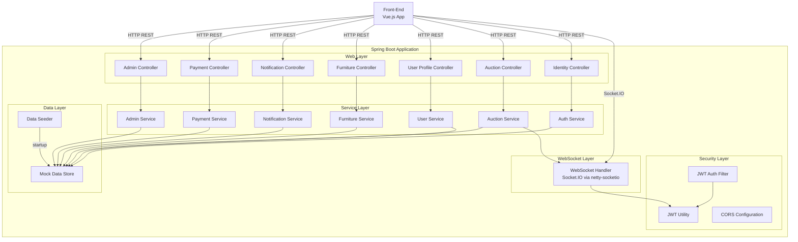

# Design Document: Mock API Service

## Overview

The Mock API Service is a Spring Boot (Java 17+) application that implements all REST endpoints and WebSocket events consumed by the Furniture Bid front-end. It uses in-memory data structures (ConcurrentHashMap-based stores) instead of a database, returning realistic mock data for development and testing purposes.

The service lives at `/Users/lingkeshrarajendram/Documents/Project/Furniture Bid/Source Code/Back-End/` and implements the contracts defined in the front-end's [API reference](/docs/api-reference.md).

### Key Design Goals

- Full API contract compliance with the front-end expectations
- Zero external dependencies (no database, no message broker, no external auth provider)
- Instant startup with pre-seeded realistic data
- CORS fully open for local development
- Socket.IO-compatible WebSocket support for real-time events
- Simplified JWT generation/validation using a hardcoded signing key

## Architecture



### Technology Stack

| Component | Technology | Rationale |
|-----------|-----------|-----------|
| Framework | Spring Boot 3.x (Java 17+) | Required by spec, industry standard |
| Build Tool | Maven | Widely used with Spring Boot, simple dependency management |
| REST | Spring Web MVC | Built-in with Spring Boot |
| WebSocket | netty-socketio | Socket.IO protocol compatibility with front-end |
| JWT | jjwt (io.jsonwebtoken) | Lightweight JWT creation/parsing |
| JSON | Jackson (Spring default) | Automatic JSON serialization |
| File Upload | Spring Multipart | Built-in multipart support |

## Components and Interfaces

### 1. JWT Utility (`JwtUtility`)

Responsible for token generation and validation with a hardcoded HMAC-SHA256 signing key.

```java
public class JwtUtility {
    String generateToken(String userId, String role);       // 1hr expiry
    Claims parseToken(String token);                        // throws on invalid
    Claims parseTokenAllowExpired(String token);            // for refresh-token
    boolean isTokenExpired(Claims claims);
}
```

### 2. JWT Authentication Filter (`JwtAuthFilter`)

A `OncePerRequestFilter` that intercepts requests to protected endpoints, extracts and validates the Bearer token, and sets the SecurityContext.

- Skips unauthenticated endpoints: `/api/auth/login`, `/api/auth/register`, `/api/auth/reset-password`, `/api/auth/social-login`, `GET /api/furniture`, `GET /api/furniture/{id}`, `GET /api/auctions/{auctionId}/bids`
- For `/api/auth/refresh-token`: allows expired tokens (calls `parseTokenAllowExpired`)
- For all other protected endpoints: rejects expired tokens with `TOKEN_EXPIRED`

### 3. Controllers

Each controller is a `@RestController` with appropriate `@RequestMapping` base path.

| Controller | Base Path | Endpoints |
|-----------|-----------|-----------|
| `IdentityController` | `/api/auth` | login, register, reset-password, refresh-token, social-login |
| `UserProfileController` | `/api/users` | profile GET/PUT, watchlist CRUD |
| `AuctionController` | `/api/auctions`, `/api/seller` | bids, auto-bid, seller listings |
| `FurnitureController` | `/api/furniture` | catalog GET, detail GET, create POST, flag PUT, delete DELETE |
| `NotificationController` | `/api/notifications` | list GET, read PUT, read-all PUT |
| `PaymentController` | `/api/payments` | create-intent POST, confirm POST, history GET |
| `AdminController` | `/api/admin` | users, listings, analytics |

### 4. Service Layer

Each service encapsulates business logic and interacts with the `MockDataStore`.

```java
public interface AuthService {
    LoginResponse login(String email, String password);
    LoginResponse register(String email, String password, String displayName);
    void resetPassword(String email);
    LoginResponse refreshToken(String userId);
    LoginResponse socialLogin(String provider, String token);
}

public interface UserService {
    User getProfile(String userId);
    User updateProfile(String userId, String displayName, String avatarUrl);
    PaginatedResponse<FurnitureListingSummary> getWatchlist(String userId, int page, int pageSize);
    void addToWatchlist(String userId, String listingId);
    void removeFromWatchlist(String userId, String listingId);
}

public interface AuctionService {
    PlaceBidResponse placeBid(String userId, String auctionId, BigDecimal amount);
    PaginatedResponse<Bid> getBidHistory(String auctionId, int page, int pageSize);
    void setAutoBid(String userId, String auctionId, BigDecimal maxAmount);
    void removeAutoBid(String userId, String auctionId);
    PaginatedResponse<SellerActiveListing> getActiveListings(String sellerId, int page, int pageSize);
    PaginatedResponse<SellerCompletedAuction> getCompletedAuctions(String sellerId, int page, int pageSize);
}

public interface FurnitureService {
    PaginatedResponse<FurnitureListingSummary> getCatalog(CatalogFilter filter);
    FurnitureListing getListingById(String id);
    FurnitureListing createListing(CreateListingRequest request, String sellerId);
    void flagListing(String listingId, String reason, String reporterId);
    void deleteListing(String listingId, String userId, String userRole);
}

public interface NotificationService {
    PaginatedResponse<Notification> getNotifications(String userId, int page, int pageSize);
    void markAsRead(String userId, String notificationId);
    void markAllAsRead(String userId);
}

public interface PaymentService {
    PaymentIntent createPaymentIntent(String userId, String auctionId, BigDecimal amount);
    void confirmPayment(String userId, String paymentIntentId);
    PaymentHistoryResponse getPaymentHistory(String userId, int page, int pageSize);
}

public interface AdminService {
    PaginatedResponse<AdminUserRow> getUsers(int page, int pageSize);
    void suspendUser(String userId);
    void activateUser(String userId);
    void deleteUser(String userId);
    PaginatedResponse<AdminListingRow> getListings(int page, int pageSize);
    void removeListing(String listingId);
    void flagListing(String listingId);
    PaginatedResponse<ListingReport> getReports(int page, int pageSize);
    AnalyticsSummary getAnalyticsSummary(LocalDate startDate, LocalDate endDate);
    List<AuctionTrend> getAuctionTrends(LocalDate startDate, LocalDate endDate);
    List<CategoryDistribution> getCategoryDistribution(LocalDate startDate, LocalDate endDate);
    List<TopSeller> getTopSellers(LocalDate startDate, LocalDate endDate);
}
```

### 5. WebSocket Handler (`SocketIOHandler`)

Uses netty-socketio to provide Socket.IO protocol support.

```java
public class SocketIOHandler {
    void onConnect(SocketIOClient client);          // validate JWT from auth.token
    void onDisconnect(SocketIOClient client);       // clean up subscriptions
    void onJoinAuction(SocketIOClient client, String auctionId);
    void onLeaveAuction(SocketIOClient client, String auctionId);
    void onSubscribeNotifications(SocketIOClient client, String userId);
    
    // Called by AuctionService after successful bid
    void broadcastBidUpdate(BidUpdateEvent event);
    void sendOutbidNotification(String userId, OutbidPayload payload);
    void sendNotification(String userId, Notification notification);
}
```

### 6. Mock Data Store (`MockDataStore`)

A singleton `@Component` holding all in-memory collections with thread-safe access.

```java
@Component
public class MockDataStore {
    ConcurrentHashMap<String, UserEntity> users;
    ConcurrentHashMap<String, FurnitureListingEntity> listings;
    ConcurrentHashMap<String, List<BidEntity>> bidsByAuction;
    ConcurrentHashMap<String, List<String>> watchlistByUser;
    ConcurrentHashMap<String, List<NotificationEntity>> notificationsByUser;
    ConcurrentHashMap<String, PaymentEntity> payments;
    ConcurrentHashMap<String, AutoBidConfig> autoBids;       // key: auctionId:userId
    ConcurrentHashMap<String, List<ListingReportEntity>> reports;
}
```

### 7. Data Seeder (`MockDataSeeder`)

An `ApplicationRunner` that populates `MockDataStore` on startup with realistic sample data.

### 8. Global Exception Handler (`GlobalExceptionHandler`)

A `@RestControllerAdvice` that catches exceptions and returns the standardized error response format.

```java
@RestControllerAdvice
public class GlobalExceptionHandler {
    @ExceptionHandler(InvalidCredentialsException.class)  // → 401
    @ExceptionHandler(UnauthorizedException.class)        // → 401
    @ExceptionHandler(TokenExpiredException.class)        // → 401
    @ExceptionHandler(ForbiddenException.class)           // → 403
    @ExceptionHandler(NotFoundException.class)            // → 404
    @ExceptionHandler(ConflictException.class)            // → 409
    @ExceptionHandler(ValidationException.class)          // → 400
    @ExceptionHandler(BidTooLowException.class)           // → 422
    @ExceptionHandler(AuctionEndedException.class)        // → 422
    @ExceptionHandler(Exception.class)                    // → 500
}
```

## Data Models

### Entity Models (Internal)

```java
public class UserEntity {
    String id;
    String email;
    String password;          // stored as plain text for mock
    String displayName;
    String role;              // "buyer" | "seller" | "admin"
    String avatarUrl;
    String status;            // "active" | "suspended" | "deleted"
    Instant createdAt;
}

public class FurnitureListingEntity {
    String id;
    String title;
    String description;
    String category;          // FurnitureCategory value
    String condition;         // FurnitureCondition value
    String brand;
    String material;
    Dimensions dimensions;
    Double weight;
    String location;
    List<String> images;
    BigDecimal startingPrice;
    BigDecimal reservePrice;
    BigDecimal currentBid;
    int bidCount;
    Instant auctionEndDate;
    String status;            // "active" | "ended" | "flagged" | "removed"
    String sellerId;
    String sellerDisplayName;
    double sellerRating;
    Instant createdAt;
}

public class BidEntity {
    String id;
    String auctionId;
    String bidderId;
    String bidderAlias;
    BigDecimal amount;
    Instant timestamp;
}

public class NotificationEntity {
    String id;
    String userId;
    String type;              // NotificationType value
    String title;
    String message;
    String auctionId;
    boolean isRead;
    Instant createdAt;
}

public class PaymentEntity {
    String id;
    String userId;
    String auctionId;
    String clientSecret;
    BigDecimal amount;
    String currency;          // always "USD"
    String status;            // "requires_payment_method" | "succeeded"
    Instant createdAt;
}

public class AutoBidConfig {
    String userId;
    String auctionId;
    BigDecimal maxAmount;
}

public class ListingReportEntity {
    String id;
    String listingId;
    String reason;
    String reporterId;
    String reporterDisplayName;
    Instant reportDate;
}

public class Dimensions {
    double width;
    double height;
    double length;
}
```

### API Response DTOs

```java
// Common paginated wrapper
public class PaginatedResponse<T> {
    List<T> data;
    int total;
    int page;
    int pageSize;
    boolean hasMore;
}

// Auth responses
public class LoginResponse {
    String token;
    UserDto user;
}

// Error response
public class ApiErrorResponse {
    int statusCode;
    String errorCode;
    String message;
    Map<String, String> fieldErrors;  // nullable
}
```

### Package Structure

```
com.furniturebid.mockapi
├── config/
│   ├── CorsConfig.java
│   ├── SecurityConfig.java
│   └── SocketIOConfig.java
├── controller/
│   ├── IdentityController.java
│   ├── UserProfileController.java
│   ├── AuctionController.java
│   ├── FurnitureController.java
│   ├── NotificationController.java
│   ├── PaymentController.java
│   └── AdminController.java
├── dto/
│   ├── request/
│   │   ├── LoginRequest.java
│   │   ├── RegisterRequest.java
│   │   ├── PlaceBidRequest.java
│   │   ├── AutoBidRequest.java
│   │   ├── CreatePaymentIntentRequest.java
│   │   ├── ConfirmPaymentRequest.java
│   │   ├── FlagRequest.java
│   │   └── SocialLoginRequest.java
│   └── response/
│       ├── LoginResponse.java
│       ├── UserDto.java
│       ├── PaginatedResponse.java
│       ├── PlaceBidResponse.java
│       ├── BidDto.java
│       ├── FurnitureListingSummaryDto.java
│       ├── FurnitureListingDto.java
│       ├── SellerActiveListingDto.java
│       ├── SellerCompletedAuctionDto.java
│       ├── NotificationDto.java
│       ├── PaymentIntentDto.java
│       ├── PaymentRecordDto.java
│       ├── AdminUserRowDto.java
│       ├── AdminListingRowDto.java
│       ├── ListingReportDto.java
│       ├── AnalyticsSummaryDto.java
│       ├── AuctionTrendDto.java
│       ├── CategoryDistributionDto.java
│       ├── TopSellerDto.java
│       └── ApiErrorResponse.java
├── entity/
│   ├── UserEntity.java
│   ├── FurnitureListingEntity.java
│   ├── BidEntity.java
│   ├── NotificationEntity.java
│   ├── PaymentEntity.java
│   ├── AutoBidConfig.java
│   ├── ListingReportEntity.java
│   └── Dimensions.java
├── exception/
│   ├── InvalidCredentialsException.java
│   ├── UnauthorizedException.java
│   ├── TokenExpiredException.java
│   ├── ForbiddenException.java
│   ├── NotFoundException.java
│   ├── ConflictException.java
│   ├── ValidationException.java
│   ├── BidTooLowException.java
│   ├── AuctionEndedException.java
│   └── GlobalExceptionHandler.java
├── security/
│   ├── JwtUtility.java
│   ├── JwtAuthFilter.java
│   └── AuthenticatedUser.java
├── service/
│   ├── AuthService.java
│   ├── UserService.java
│   ├── AuctionService.java
│   ├── FurnitureService.java
│   ├── NotificationService.java
│   ├── PaymentService.java
│   └── AdminService.java
├── store/
│   ├── MockDataStore.java
│   └── MockDataSeeder.java
├── websocket/
│   └── SocketIOHandler.java
└── MockApiApplication.java
```


## Correctness Properties

*A property is a characteristic or behavior that should hold true across all valid executions of a system—essentially, a formal statement about what the system should do. Properties serve as the bridge between human-readable specifications and machine-verifiable correctness guarantees.*

### Property 1: JWT Token Round-Trip

*For any* valid userId string and any valid UserRole value, generating a JWT token and then parsing it should produce claims where the extracted userId equals the original userId, the extracted role equals the original role, and the exp claim is exactly 3600 seconds after the token's issued-at time.

**Validates: Requirements 3.1, 3.2**

### Property 2: Registration Input Validation

*For any* registration request where the email is a well-formed email format, the password is 8–64 characters containing at least 1 uppercase letter, 1 lowercase letter, and 1 digit, and the displayName is 3–50 characters, the system shall return a 200 response with a valid JWT token and User object with role "buyer". Conversely, *for any* registration request where any field violates its constraints (malformed email, password outside length bounds or missing required character classes, or displayName outside 3–50 chars), the system shall return a 400 response with fieldErrors identifying the invalid fields.

**Validates: Requirements 2.3, 2.5**

### Property 3: Bid Amount Threshold

*For any* active auction with a known currentBid and minimum increment of 5.00, and *for any* bid amount: if the amount is greater than or equal to currentBid + 5.00, then the bid placement shall return success:true with a valid Bid object; if the amount is less than currentBid + 5.00, then the bid placement shall return success:false with an error message indicating the minimum acceptable amount.

**Validates: Requirements 5.1, 5.2**

### Property 4: Catalog Filtering Correctness

*For any* combination of filter parameters (category subset, condition subset, priceMin, priceMax, location), all items returned by GET /api/furniture shall satisfy: (a) status equals "active", (b) category is in the requested category set (if provided), (c) condition is in the requested condition set (if provided), (d) currentBid is >= priceMin and <= priceMax (if provided), and (e) location contains the query string as a case-insensitive substring (if provided). When priceMin > priceMax, the result shall be an empty data array.

**Validates: Requirements 7.1, 7.3, 7.4, 7.5, 7.6**

### Property 5: Catalog Sort Order

*For any* valid sort parameter value ("ending-soonest", "price-low-high", "price-high-low", "newest") and any filter combination, the items returned by GET /api/furniture shall be ordered according to the sort criteria: "ending-soonest" by timeRemaining ascending, "price-low-high" by currentBid ascending, "price-high-low" by currentBid descending, "newest" by createdAt descending. When an invalid sort value is provided, the default "ending-soonest" ordering shall be applied.

**Validates: Requirements 7.2**

### Property 6: Pagination Correctness

*For any* paginated endpoint, *for any* total item count N, *for any* page >= 1 and pageSize in [1, 100]: (a) the returned data array shall contain at most pageSize items starting at offset (page-1)*pageSize, (b) the total field shall equal N (the count of all items matching filters), (c) hasMore shall be true if and only if (page-1)*pageSize + pageSize < N, (d) when the offset exceeds N the data array shall be empty with hasMore=false. For page < 1 or pageSize < 1 or pageSize > 100, the endpoint shall return HTTP 400.

**Validates: Requirements 17.1, 17.4, 17.5, 17.6, 17.7**

### Property 7: Chronological Descending Sort Order

*For any* list response from the bid history, notifications, payment history, or listing reports endpoints, the items shall be sorted by their timestamp field (timestamp, createdAt, or reportDate respectively) in descending order—that is, for any two consecutive items in the array, the first item's timestamp shall be greater than or equal to the second item's timestamp.

**Validates: Requirements 5.3, 9.1, 10.4, 12.4**

### Property 8: Auction Trends Day Count

*For any* valid date range [startDate, endDate] where startDate <= endDate, the array returned by GET /api/admin/analytics/auction-trends shall contain exactly (endDate - startDate + 1) entries, one per calendar day, where each entry has a valid ISO 8601 date and non-negative integer values for auctionsCreated and auctionsCompleted.

**Validates: Requirements 13.2**

### Property 9: Category Distribution Completeness

*For any* valid date range, the array returned by GET /api/admin/analytics/category-distribution shall contain exactly 8 entries, one for each FurnitureCategory value (sofa, dining-table, office-chair, wardrobe, bed-frame, coffee-table, cabinet, bookshelf), each with a non-negative integer count.

**Validates: Requirements 13.3**

### Property 10: Top Sellers Bounded and Sorted

*For any* valid date range, the array returned by GET /api/admin/analytics/top-sellers shall contain at most 10 entries, sorted by totalRevenue in descending order, where each entry has a positive completedAuctions count and a positive totalRevenue value.

**Validates: Requirements 13.4**

### Property 11: Error Response Structure Consistency

*For any* request that triggers an error condition (4xx or 5xx), the response body shall be a JSON object containing statusCode (matching the HTTP status code), errorCode (a non-empty string), and message (a string of 1–256 characters). When the error is a validation failure (HTTP 400 with errorCode INVALID_REQUEST), the response shall additionally contain a fieldErrors object with at least one entry.

**Validates: Requirements 15.1, 15.2**

## Error Handling

### Exception Hierarchy

All custom exceptions extend a base `ApiException` that carries statusCode, errorCode, and message:

| Exception | HTTP Status | Error Code | Trigger |
|-----------|------------|------------|---------|
| `InvalidCredentialsException` | 401 | INVALID_CREDENTIALS | Wrong email/password |
| `UnauthorizedException` | 401 | UNAUTHORIZED | Missing/malformed token |
| `TokenExpiredException` | 401 | TOKEN_EXPIRED | Expired JWT (non-refresh) |
| `ForbiddenException` | 403 | FORBIDDEN | Insufficient role |
| `NotFoundException` | 404 | NOT_FOUND | Resource not found |
| `ConflictException` | 409 | CONFLICT | Duplicate resource |
| `ValidationException` | 400 | INVALID_REQUEST | Field validation failure |
| `BidTooLowException` | 422 | BID_TOO_LOW | Bid below minimum |
| `AuctionEndedException` | 422 | AUCTION_ENDED | Bid on ended auction |

### Global Exception Handler Strategy

The `@RestControllerAdvice` catches all exceptions and maps them to the standardized `ApiErrorResponse` format. Unhandled exceptions produce a 500 `INTERNAL_ERROR` response without exposing stack traces.

### Input Validation Strategy

- Use Java Bean Validation annotations (`@NotBlank`, `@Size`, `@Email`, `@Pattern`) on request DTOs where possible
- Custom validation logic in service layer for cross-field validation (e.g., reservePrice >= startingPrice)
- `ValidationException` carries a `Map<String, String>` of fieldErrors

### WebSocket Error Handling

- Connection-time auth failures: emit error event and disconnect client
- Runtime errors in event handlers: log internally, no crash propagation

## Testing Strategy

### Testing Framework

- **JUnit 5** for unit and integration tests
- **Spring Boot Test** (`@SpringBootTest`, `@WebMvcTest`) for controller integration tests
- **jqwik** for property-based testing (Java PBT library)
- **Mockito** for mocking service dependencies in unit tests
- **MockMvc** for HTTP endpoint testing without starting a full server

### Test Structure

```
src/test/java/com/furniturebid/mockapi/
├── property/                          # Property-based tests
│   ├── JwtRoundTripPropertyTest.java
│   ├── RegistrationValidationPropertyTest.java
│   ├── BidThresholdPropertyTest.java
│   ├── CatalogFilterPropertyTest.java
│   ├── CatalogSortPropertyTest.java
│   ├── PaginationPropertyTest.java
│   ├── ChronologicalSortPropertyTest.java
│   ├── AuctionTrendsPropertyTest.java
│   ├── CategoryDistributionPropertyTest.java
│   ├── TopSellersPropertyTest.java
│   └── ErrorResponsePropertyTest.java
├── unit/                              # Unit tests
│   ├── JwtUtilityTest.java
│   ├── AuthServiceTest.java
│   ├── AuctionServiceTest.java
│   ├── FurnitureServiceTest.java
│   └── ...
├── integration/                       # Integration tests
│   ├── IdentityControllerIntegrationTest.java
│   ├── AuctionControllerIntegrationTest.java
│   ├── WebSocketIntegrationTest.java
│   └── ...
└── smoke/                             # Smoke tests
    └── ApplicationStartupTest.java
```

### Property-Based Testing Configuration

- Library: **jqwik** (io.jqwik:jqwik:1.8.x)
- Minimum iterations: 100 per property test
- Each property test is tagged with a comment referencing the design property:
  ```java
  // Feature: mock-api-service, Property 1: JWT Token Round-Trip
  ```

### Unit Test Coverage

Unit tests focus on:
- Specific success/failure examples for each endpoint
- Edge cases (empty inputs, boundary values, non-existent IDs)
- Role-based access control (buyer vs seller vs admin)
- Mock data seeder produces expected seed data

### Integration Test Coverage

Integration tests focus on:
- WebSocket connection, subscription, and event delivery
- Full request lifecycle through controllers to data store
- CORS header presence
- Content-Type verification

